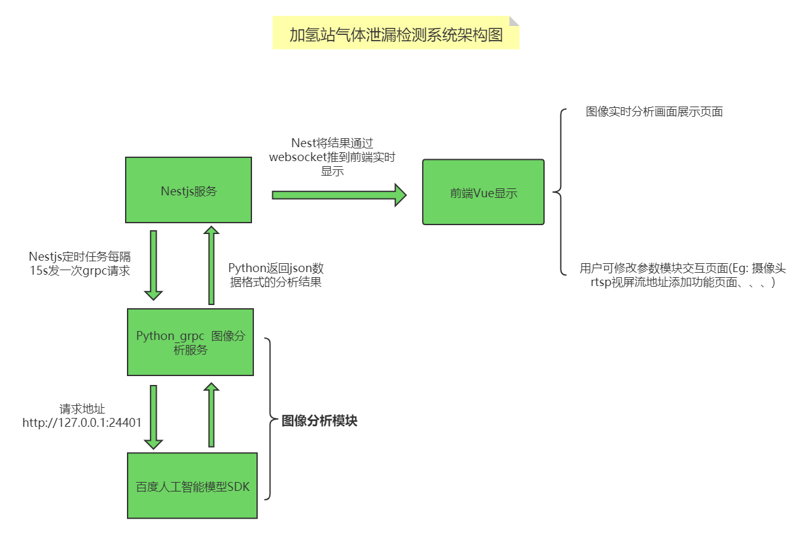

# 气体泄漏检测说明文档
---
## 项目构成总览

- nestjs主服务 `负责系统定时任务的执行，数据库操作`
- python图像分析服务
- [百度人工智能模型SDK](https://ai.baidu.com/easydl/app/2/200/models) `账号：13009470871 密码：b1qaz2wsx!@`
- 前端vue页面

## 项目架构图

## 项目构成详细说明
### nestjs主服务
主服务中主要有五个模块，分别为：`定时任务模块` `报警记录模块` `摄像头管理模块` `用户模块` `系统日志模块`
* `定时任务模块`：主要过程为先从数据库拿到所有的摄像头，再将摄像头的rtsp视屏流地址作为参数通过grpc请求传入python图像分析服务，python将会从这个传入的rtsp参数对应的视屏流中获取一帧进行分析，异步返回分析结果，返回的分析结果会被存入数据库中的报警记录表，然后将这个实时数据通过websocket推到vue前端
* `报警记录模块`： 主要负责数据库中报警记录表的增删改查操作
* `摄像头管理模块`：主要负责摄像头的增删改查操作
* `用户管理`：只有用户登录功能，账号密码为默认值 `root@123qwe`
* `系统日志模块`：负责系统日志的收集和系统日志表的增删改查操作

### python图像分析服务

因为最终图像分析的任务交给了百度人工智能SDK去做，所以python这边主要的作用是：
- 处理rtsp视屏流并从视屏流中获取图片
- 将获取到的图片通过http://127.0.0.1:24401/传入百度SDK并拿到结果
- 将拿到的结果中的坐标数据进行转换，在被分析图片上进行绘制标注，让分析结果直观地展示出来
- 将处理好的结果返回给nestjs主服务

### 百度人工智能模型SDK
* 这个模块是整个项目的核心，SDK由[百度EasyDL平台](https://ai.baidu.com/easydl/app/2/200/models)通过模型训练自动生成， SDK中包含一个exe应用文件，一份模型，一些从平台更新模型的bat脚本
* 由于目前的模型是在模拟场景下训练出来的结果，所以模型必然和真实场景有着一定的差别，后续项目负责人员可以在有真实场景的条件下向百度EasyDL平台提交一些真实场景数据，训练升级模型，以达到更好的识别效果

### 前端vue页面
* 整个项目的门面